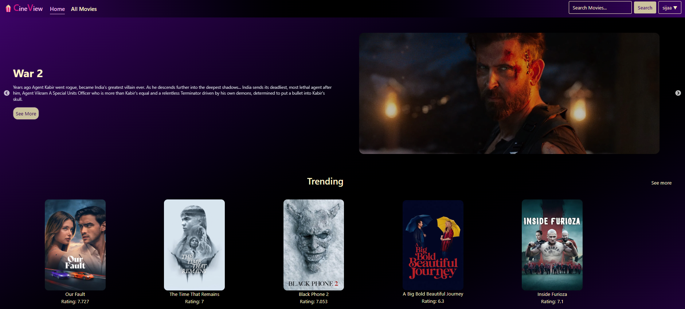
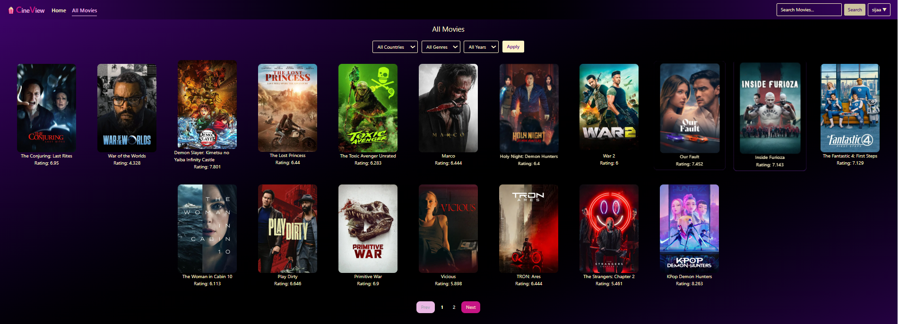
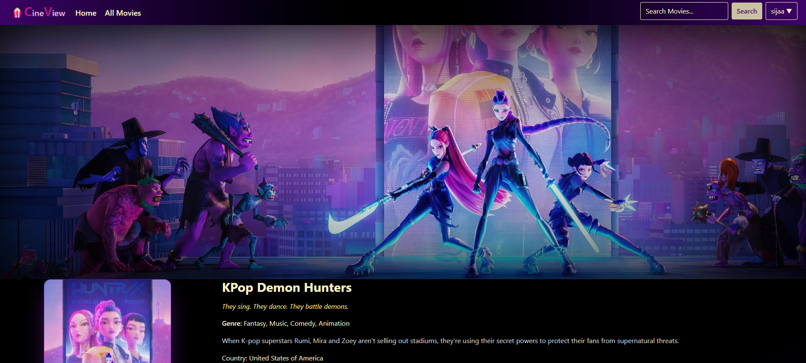
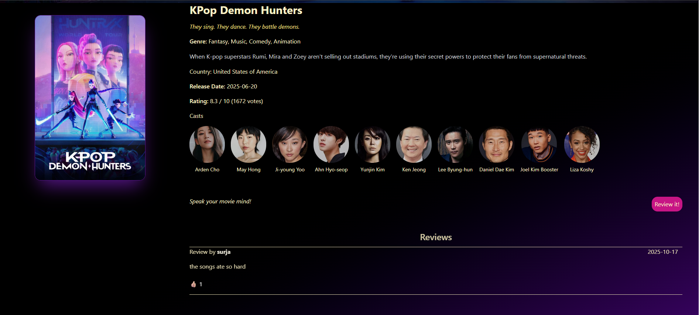
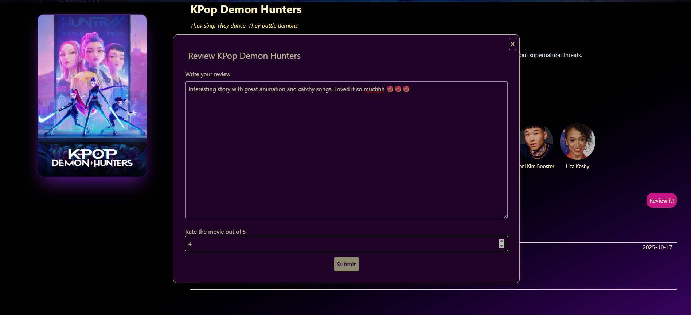
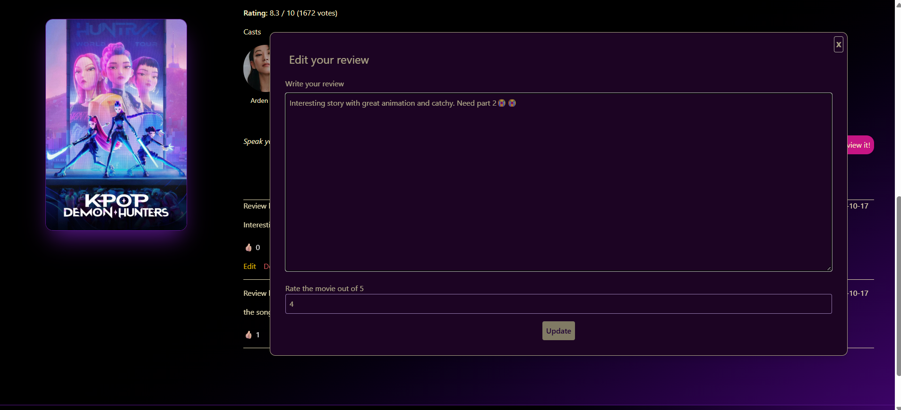
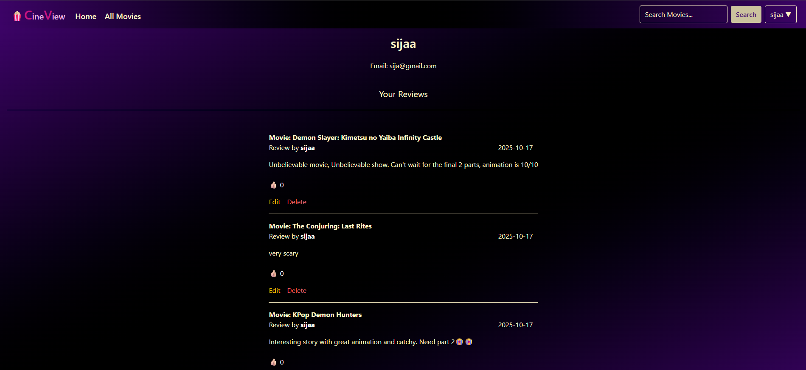
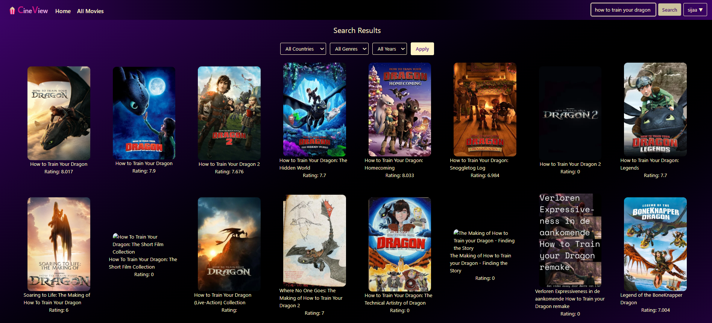
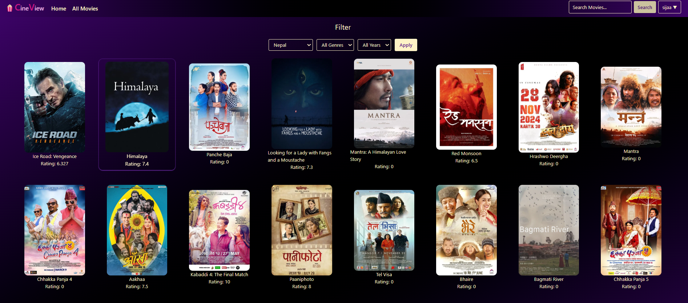

## 🍿 CineView - A Movie Review Web application

CineView is a web application designed to explore movies, share opinions and discover reviews on a wide range of movies provided by TMDB API. This web application is built with React on frontend and Django REST Framework on the backend.

----

## ✨Key Features

**Reviewing Movies**: Add, Edit, Delete and View reviews on different movies.

**Filtering**: Filter movies by country, year and genre.

**Movie details**: View movie details like genre, casts, countries.

**Profile**: User profile to view their reviews.

**User Authentication**: Secure login,registration and authentication with JWT based authentication.

**Likes System** — Like and unlike movie reviews instantly.

----

## 🚀 Technologies Used
| Purpose	  | Technologies            |
|-----------|-------------------------|
| Frontend	|React, TailwindCSS       |
| Backend	  |Django Rest Framework    |
| Database	|SQLite       |

## 📸 Snapshots of the Project
###### Home

-----
###### All Movies Page

-----
###### Movies Detail Page

-----
###### Add Review

-----

###### Edit Review

-----
###### Profile Page

-----

###### Search Results

-----
###### Filter Results

-----
## ⚙️ Setup Instructions

### ✅ Prerequisites

- Python 3.x installed  
- Node.js & npm installed  
- `pip` installed  
- A virtual environment tool (optional but recommended)  

---

### 🖥️ Steps to Run the Project
#### 1.Clone the Repository

      git clone https://github.com/Surja11/Movie-review.git
      cd Movie-review

#### 2.Backend Setup

  ##### Create a Virtual Environment

      (Optional but Recommended)
      On Windows:

      python -m venv venv
      venv\Scripts\activate

      On macOS/Linux:

      python3 -m venv venv
      source venv/bin/activate

  ##### Install Dependencies

      pip install -r requirements.txt

  ##### Apply Migrations
      
      cd backend
      python manage.py makemigrations 
      python manage.py migrate

  ##### Create Superuser (Optional – for Admin Access)

      python manage.py createsuperuser

  ##### Run the Development Server

      python manage.py runserver

  ##### Access the Application

      Open your browser and go to:

      http://127.0.0.1:8000/

#### 3.Frontend Setup

      cd frontend

      npm install
      
      npm run dev

